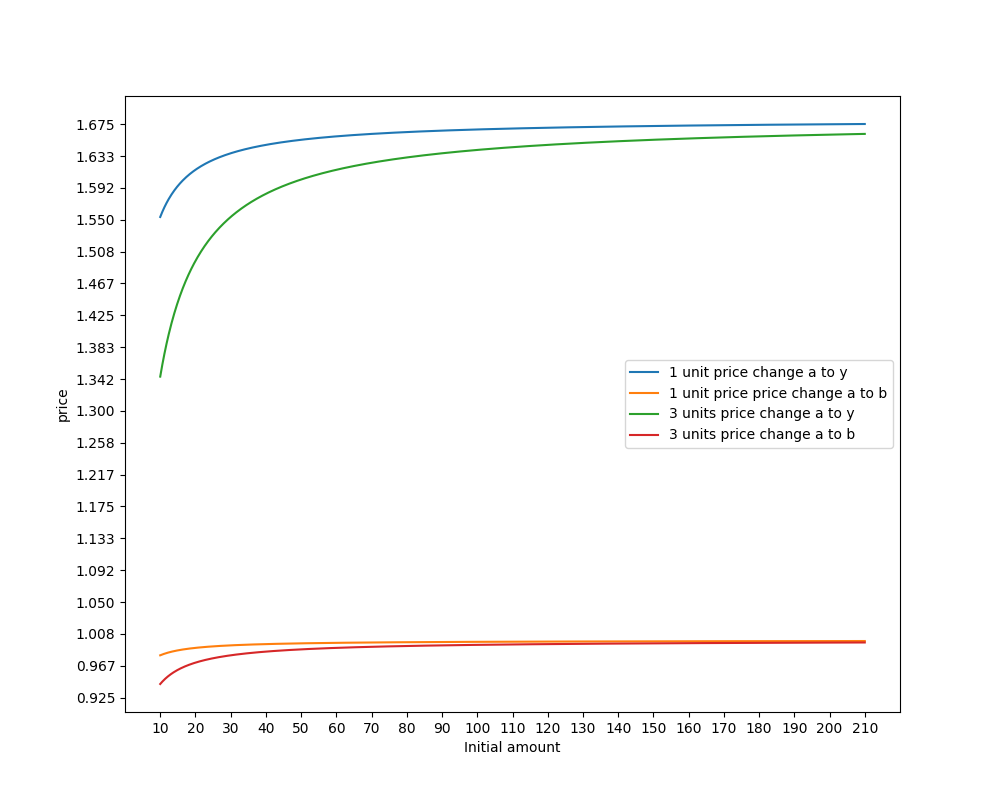

# AMM-SmartContract


## Introduction

Suppose we want to design a three-product AMM: an AMM that can trade cash (that is, say, some stablecoin), which we’ll call **y**, with two different kinds of tokens, **a** and **b**. Suppose also that **a** and **b** are “similar” products in some sense. Here are some hypothetical examples.

Consider an AMM which uses the following class of functions as a “constant curve”:

$$ M(a, b, y) = ((a^{1-\sigma} + b^{1-\sigma})^{\frac{1}{1-\sigma}})^{1-\eta} + y^{1-\eta} $$

This defines an AMM, since, suppose the stablecoin begins with **a**, **b**, **y**. Suppose an agent wants to buy **y** by paying **a**.
The AMM is willing to keep *M* value. Let's show the price change per buying unit as follows.

<p align="center">
  
</p>

## Deploy to Ropsten

- UNI token address: 0x1f9840a85d5af5bf1d1762f925bdaddc4201f984
- COMP token address: 0xf76D4a441E4ba86A923ce32B89AFF89dBccAA075
- DAI token address: 0xaD6D458402F60fD3Bd25163575031ACDce07538D

You need `.secret` file to deploy to testnet with your mnemonic.
If you are the creater of AMM contract, firstly you should deposit initial tokens. 
Before each deposit and swap, you need to call ERC20 `approve` mechanism. (*approve* button in UI).


```bash
# Deploy
truffle deploy --network ropsten --reset

# Interact
truffle console --network ropsten --verbose-rpc

# Frontend
yarn && yarn start
```

## Reference 

https://github.com/anthonyleezhang/nestedamm/blob/main/nestedamm.pdf

